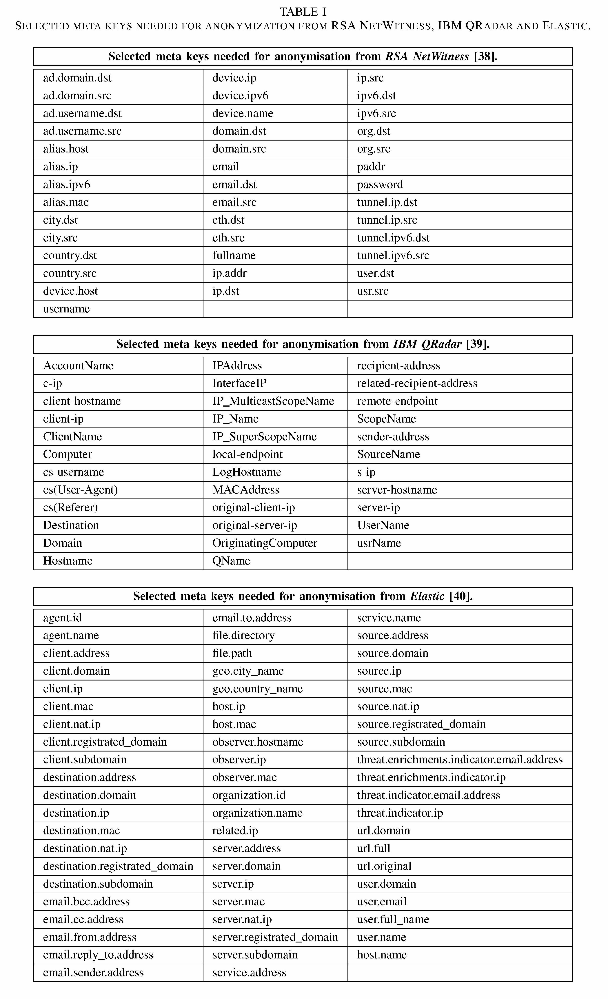
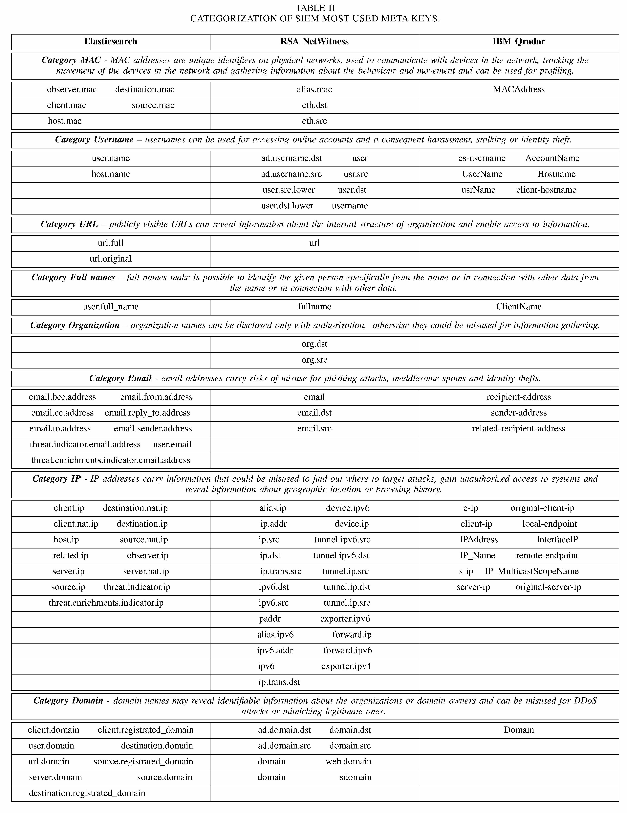

# Security-Log-Anonymizor

## Overview

Security Information and Event Management (SIEM) systems are central components of modern security monitoring. They collect, normalize, correlate, and analyze security-relevant events from heterogeneous sources such as operating systems, network devices, cloud services, endpoint tools, identity platforms, and applications.

Security logs are highly valuable for artificial intelligence and deep learning research because they contain operationally realistic patterns of user activity, system behavior, network communication, and security events. At the same time, these logs may include sensitive technical, organizational, and potentially personal information, such as IP addresses, usernames, e-mail addresses, domain names, URLs, hostnames, directory paths, and other identifiers.

**Security-Log-Anonymizor** is a privacy-preserving anonymization tool designed for security logs and SIEM-exported data. Its main purpose is to replace sensitive values while preserving the structural and semantic properties required for AI-driven security analysis. Unlike generic anonymization utilities, the tool is designed specifically for security monitoring data and aims to preserve log format, event structure, value consistency, and correlations within a processing session.

The tool supports both raw-log anonymization and normalized JSON processing based on SIEM meta keys. This makes it applicable to unstructured log files as well as exported SIEM records.

## Main Objectives

The tool is designed to support the following objectives:

- Enable privacy-preserving use of security logs for AI and deep learning research.
- Reduce legal, contractual, and operational risks associated with sharing or processing sensitive log data.
- Preserve the utility of anonymized logs for model training, validation, testing, and reproducible experiments.
- Support both raw unstructured logs and normalized SIEM JSON exports.
- Maintain recurring-value consistency during a single anonymization run.
- Avoid persistent pseudonymization tables by using runtime dictionaries that can be cleared after processing.

## Key Features

- **Raw-log anonymization**  
  Detects sensitive values directly in unstructured log messages using regular expressions.

- **Normalized JSON anonymization**  
  Uses predefined SIEM meta keys to locate and anonymize sensitive values in already normalized records.

- **SIEM-specific meta-key mapping**  
  Includes predefined meta-key configurations for selected SIEM platforms:
  - Elasticsearch
  - RSA NetWitness
  - IBM QRadar
  - Splunk

- **Format-preserving replacement**  
  Replaces sensitive values with realistic pseudovalues while preserving the expected data format.

- **Session-level consistency**  
  Replaces identical original values with identical anonymized values during one processing run, preserving correlations in log sequences.

- **Runtime-only mapping dictionaries**  
  Uses in-memory dictionaries during processing and clears them after anonymization to reduce residual exposure.

- **Support for multiple input types**  
  Supports single log records, files of raw logs, batched log data, and JSON-formatted SIEM exports.

- **Configurable sensitive categories**  
  Allows selected categories to be enabled or disabled through configuration.

## Sensitive Data Categories

The current implementation focuses on security-log attributes that may reveal personal, organizational, or infrastructure-sensitive information.

Supported categories include:

- IP addresses
- E-mail addresses
- MAC addresses
- Usernames
- Directory paths
- Full names
- URLs
- Domain names
- Organization names

Depending on the input mode, some categories are detected using regular expressions, while others are extracted from predefined SIEM meta keys.

## Processing Modes

### 1. Raw-Log Mode

Raw-log mode is used for unstructured log messages. Sensitive values are detected directly in the raw text using regular expressions.

This mode is suitable for categories with relatively well-defined textual patterns, such as:

- e-mail addresses
- MAC addresses
- URLs

The anonymized output preserves the original log structure while replacing the detected sensitive values.

### 2. Normalized JSON Mode

Normalized JSON mode is used for logs already parsed or exported from SIEM platforms. Instead of scanning the full raw payload, the tool searches predefined meta keys that are known to contain sensitive values.

This mode is suitable for categories such as:

- usernames
- full names
- organization names
- IP addresses
- domain names

This approach is generally more precise and efficient when the input data has already been normalized by a SIEM platform.

## Architecture

The tool is implemented as a Python-based microservice using Flask. The application exposes API endpoints for receiving log data, applying the selected anonymization logic, and returning anonymized output.

At a high level, the workflow consists of the following steps:

1. Receive a log record, raw log file, batch of logs, or JSON log object.
2. Identify the configured processing mode.
3. Detect sensitive values using either:
   - regular expressions for raw logs, or
   - SIEM meta-key lookup for normalized JSON logs.
4. Generate replacement values using format-preserving anonymization functions.
5. Store value mappings in runtime dictionaries during the processing session.
6. Replace detected values in the original input.
7. Return the anonymized output.
8. Clear runtime dictionaries after processing.

The tool does not require persistent storage for replacement mappings.

## Technology Stack

The application is developed in Python and uses Flask for API-based processing.

Recommended runtime:

- **Python 3.14.x**

Minimum recommended runtime:

- **Python 3.13+**

Main technologies and libraries:

- Python
- Flask
- Faker
- Regular expressions
- JSON processing

## Installation

Clone the repository:

```bash
git clone <anonymized-repository-url>
cd Security-Log-Anonymizor
```

Create and activate a virtual environment:

```bash
python3.14 -m venv .venv
source .venv/bin/activate
```

For Windows:

```bash
python -m venv .venv
.venv\Scripts\activate
```

Install dependencies:

```bash
pip install --upgrade pip
pip install -r requirements.txt
```

## Running the Application

Start the Flask application:

```bash
python app.py
```

By default, the application configuration is defined in:

```text
config.py
```

The IP address, port, and anonymization settings can be adjusted there.

## Repository Structure

```text
Security-Log-Anonymizor/
│
├── app.py
├── config.py
├── functions.py
├── jsonfile.py
├── metakeys_config.py
├── regex.py
├── replace.py
├── requirements.txt
├── images/
│   ├── flow-chart.png
│   ├── all.jpg
│   └── category.jpg
└── README.md
```

## Component Description

### `app.py`

Main executable file. It initializes the Flask application and defines the API endpoints used for log anonymization.

### `functions.py`

Contains the core anonymization logic. It implements replacement functions for supported sensitive data categories and maintains runtime dictionaries for preserving value consistency during processing.

### `jsonfile.py`

Implements anonymization of JSON-formatted logs. It uses predefined SIEM meta-key mappings from `metakeys_config.py` and applies the corresponding anonymization functions from `functions.py`.

### `replace.py`

Contains helper functions for replacing detected sensitive values in raw log strings and JSON key-value pairs.

### `regex.py`

Contains regular-expression-based detection logic for raw unstructured logs. It processes logs line by line and replaces detected values with anonymized values generated by the corresponding anonymization functions.

### `metakeys_config.py`

Defines SIEM-specific meta-key mappings for normalized JSON processing. The configuration currently includes selected meta keys for:

- Elasticsearch
- RSA NetWitness
- IBM QRadar
- Splunk

The meta keys are grouped by sensitive data category and can be extended for additional platforms or custom fields.

### `config.py`

Contains application settings, including network configuration and anonymization-category switches. Individual data types can be enabled or disabled according to the target use case.

## Supported SIEM Meta-Key Mapping

The normalized processing mode uses predefined SIEM meta keys to identify fields that may contain sensitive values. The current mapping covers selected fields from four SIEM platforms:

| SIEM platform | Supported mapping |
|---|---|
| Elasticsearch | Selected metadata, network, user, e-mail, URL, and host-related fields. |
| RSA NetWitness | Selected IP, domain, user, MAC, URL, organization, and e-mail fields. |
| IBM QRadar | Selected account, host, IP, MAC, domain, and e-mail fields. |
| Splunk | Selected CIM-oriented fields related to identity, network, URL, e-mail, domain, and organization data. |

The mapping is intended as a default baseline. In real deployments, custom fields and organization-specific mappings should be reviewed and added before processing production data.

## Program Workflow

Technical representation of the anonymization workflow:

<p align="center">
    
</p>

## Meta-Key Categorization

The tool uses SIEM-specific meta keys and maps them to general sensitive-data categories. This reduces the complexity of anonymizing normalized logs because multiple SIEM fields may represent the same type of sensitive value.

**Selected SIEM meta keys used for anonymization:**

<p align="center">
    
</p>

**Mapping of selected meta keys to sensitive-data categories:**

<p align="center">
    
</p>

## Data Protection Approach

The anonymization process is based on the following principles:

- Replace sensitive values rather than removing entire log records.
- Preserve log structure and original formatting wherever possible.
- Maintain consistency of repeated values within one anonymization session.
- Avoid long-term storage of original-to-anonymized mappings.
- Clear runtime dictionaries after processing.
- Support selective anonymization based on configured data categories.
- Preserve enough semantic structure for AI-based analysis and security research.

## Evaluation Summary

The tool was evaluated on security logs from multiple sources, including operating systems and security solutions. Two processing modes were considered:

- **regex-based raw-log processing**
- **meta-key-based normalized JSON processing**

The evaluation showed that normalized JSON processing based on predefined SIEM meta keys can be substantially faster than raw regular-expression processing, especially when the relevant values are already available in normalized fields. The results should be interpreted as implementation- and dataset-specific, because runtime depends on hardware, log volume, log structure, normalization quality, and the complexity of evaluated rules.

## Limitations

The tool provides a practical anonymization layer for security-log processing, but several limitations remain:

- The default meta-key mappings may not cover all custom SIEM fields.
- Organization-specific fields should be reviewed before production use.
- Regex-based detection may miss values that do not follow expected patterns.
- Anonymization quality depends on the selected categories and the input data structure.
- Pseudovalue consistency is preserved only within a single processing run unless persistent mapping is explicitly implemented.
- Legal compliance must be evaluated in the context of the specific deployment, data type, jurisdiction, and sharing scenario.

## Future Work

Planned extensions include:

- Support for additional SIEM and XDR platforms.
- Broader meta-key coverage for vendor-specific and custom fields.
- Improved validation of anonymized output.
- Additional anonymization strategies for higher-risk data categories.
- Integration with locally deployed AI components for assisted configuration and sensitive-field discovery.
- Extended benchmarking on larger and more diverse log datasets.

## Anonymity Notice

This repository version is prepared for anonymized review and does not contain author names, institutional identifiers, or repository-owner information.
